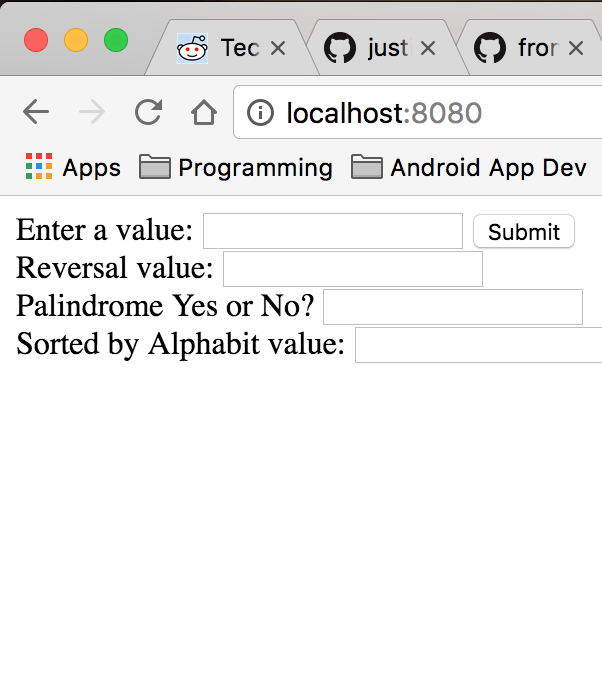
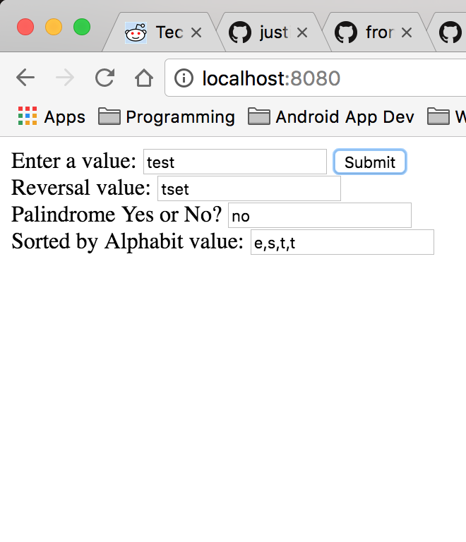
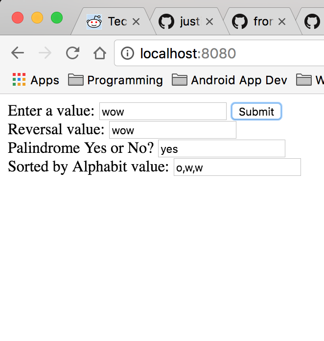

#String Manipulation


## Description
In this exercise the user is give an input field and a button. The user enters a string of text and clicks the submit button. The text is reversed, tested for a [palindrome](https://en.wikipedia.org/wiki/Palindrome) and sorted in alphabetic order.

## How to run
In your terminal run:
```
http-server -p 9999
```
then navigate to http://localhost:9999 in your browser.

## Screenshots
## On Page Load

## Example of a String

## Example of a Palindrome


## Contributors
- [Justin Leggett](https://github.com/justinal64)